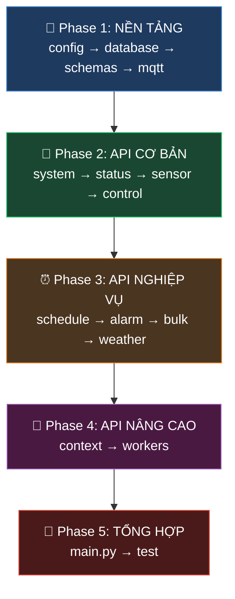

# Implementation Plan: Triển Khai 30 REST API Endpoints

## Mục Tiêu

Triển khai toàn bộ 30 endpoints REST API theo [api_specification.md](file:///C:/Users/LENOVO/.gemini/antigravity/brain/6a62349d-9a92-468d-9169-60db1dfe8571/api_specification.md) cho dự án PBL5 Smart Home, dựa trên codebase hiện có.

## Cấu Trúc Thư Mục Sau Khi Hoàn Thành

```
backend/
├── main.py                          ← Entry point (SỬA)
├── core/
│   ├── __init__.py                  ← (MỚI)
│   ├── config.py                    ← Cấu hình tập trung (MỚI)
│   └── database.py                  ← Database module (ĐÃ CÓ, SỬA)
├── models/
│   ├── __init__.py                  ← (MỚI)
│   └── schemas.py                   ← Pydantic schemas tập trung (MỚI)
├── services/
│   ├── __init__.py                  ← (MỚI)
│   └── mqtt_service.py              ← MQTT client (ĐÃ CÓ, SỬA TÊN)
├── routers/
│   ├── __init__.py                  ← (MỚI)
│   ├── system_routers.py            ← Nhóm 1: Health + Time (MỚI)
│   ├── control_routers.py           ← Nhóm 2: Điều khiển (SỬA)
│   ├── status_routers.py            ← Nhóm 3: Trạng thái (SỬA)
│   ├── sensor_routers.py            ← Nhóm 4: Cảm biến (MỚI)
│   ├── schedule_routers.py          ← Nhóm 5: Hẹn giờ (SỬA)
│   ├── alarm_routers.py             ← Nhóm 6: Báo thức (MỚI)
│   ├── bulk_routers.py              ← Nhóm 7: Hàng loạt (MỚI)
│   ├── weather_routers.py           ← Nhóm 8: Thời tiết (SỬA)
│   └── context_routers.py           ← Nhóm 9: Gợi ý ngữ cảnh (MỚI)
└── workers/
    ├── __init__.py                  ← (ĐÃ CÓ)
    └── worker.py                    ← Background tasks (SỬA)
```

---

## Nguyên Tắc Thứ Tự Code



> **Quy tắc vàng:** Code **từ dưới lên** — tầng nào **không phụ thuộc** ai thì code trước. Config/Database/Schema không gọi Router, nên code trước. Router gọi Database + MQTT, nên code sau.

---

## PHASE 1: NỀN TẢNG (Foundation Layer)

> Phase này tạo ra 4 file "xương sống" mà mọi router đều phụ thuộc vào. **Không code gì ở router cho đến khi 4 file này xong.**

---

### Bước 1.1: `core/config.py` — Cấu Hình Tập Trung

#### [NEW] [config.py](file:///e:/University/semeter6/PBL5/PBL5_DoAnNhaThongMinh/backend/core/config.py)

**Tại sao code trước?** Mọi file khác đều import config từ đây. Nếu không có, phải hardcode IP, port, API key rải rác khắp nơi.

**Nội dung cần code:**
```python
# Tập trung tất cả "magic values" đang rải rác trong code cũ

MQTT_BROKER = "172.20.10.2"       # Lấy từ mqtt_clients.py dòng 10
MQTT_PORT = 1883                   # Lấy từ mqtt_clients.py dòng 11
DB_NAME = "smarthome2.db"          # Lấy từ database.py dòng 6
OPENWEATHER_API_KEY = "your_key"   # Lấy từ weather_routers.py dòng 6
DEFAULT_CITY = "Da Nang"           # Lấy từ weather_routers.py dòng 11
SERVER_PORT = 5000                 # Lấy từ main.py dòng 47
```

**Kỹ thuật:** Dùng `os.environ.get()` để có thể override bằng biến môi trường, fallback về giá trị mặc định.

---

### Bước 1.2: `core/database.py` — Database Layer

#### [MODIFY] [database.py](file:///e:/University/semeter6/PBL5/PBL5_DoAnNhaThongMinh/backend/core/database.py)

**Tại sao code thứ 2?** Phụ thuộc `config.py` (lấy DB_NAME). Tất cả routers sẽ gọi hàm từ file này.

**Giữ nguyên từ code cũ:**
- `get_db_connection()`
- `init_db()` (tạo bảng + seed data)
- `insert_sensor_data()`
- `get_latest_sensor_data()`
- `delete_old_history()`

**Thêm mới để phục vụ API mới:**
```python
# ---- CÁC HÀM MỚI CẦN THÊM ----

def get_device_by_id(device_id: int) -> dict | None:
    """Lấy thông tin 1 thiết bị theo ID — dùng cho control + status routers"""

def get_devices_by_type(device_type: str) -> list[dict]:
    """Lấy tất cả thiết bị theo loại — dùng cho bulk routers"""

def get_devices_by_room(room_slug: str) -> list[dict]:
    """Lấy tất cả thiết bị theo phòng — dùng cho status/rooms/{slug}"""

def get_room_by_slug(slug: str) -> dict | None:
    """Lấy thông tin phòng — dùng cho validate room"""

def update_device_status(device_id: int, status: str):
    """Cập nhật trạng thái thiết bị — dùng chung cho tất cả control routers"""

def get_sensor_history(device_id: int, limit: int, from_time: str, to_time: str) -> list[dict]:
    """Lấy lịch sử cảm biến có filter — dùng cho sensor/history API"""

# ---- BẢNG MỚI: alarms ----
def init_db():
    # ... giữ nguyên code cũ ...
    # THÊM bảng alarms:
    cursor.execute('''
        CREATE TABLE IF NOT EXISTS alarms (
            alarm_id TEXT PRIMARY KEY,
            time TEXT NOT NULL,
            repeat BOOLEAN DEFAULT 0,
            label TEXT,
            status TEXT DEFAULT 'active',
            created_at DATETIME DEFAULT CURRENT_TIMESTAMP
        )
    ''')
```

**Lưu ý quan trọng:**

> [!IMPORTANT]
> Phải import `DB_NAME` từ `core.config` thay vì hardcode. Sửa dòng đầu:
> ```python
> from core.config import DB_NAME
> ```

---

### Bước 1.3: `models/schemas.py` — Pydantic Schemas

#### [NEW] [schemas.py](file:///e:/University/semeter6/PBL5/PBL5_DoAnNhaThongMinh/backend/models/schemas.py)

**Tại sao code thứ 3?** Không phụ thuộc gì ngoài Pydantic. Tất cả routers import schema từ đây để validate request body.

**Nội dung:** Gom tất cả `BaseModel` đang rải rác trong các router cũ + thêm mới:

```python
from pydantic import BaseModel
from typing import Optional

# ---- CONTROL SCHEMAS ----
class LightControlRequest(BaseModel):
    state: str          # "on" / "off"

class FanControlRequest(BaseModel):
    state: str          # "on" / "off"
    speed: Optional[int] = None  # 0-3, mặc định 2 khi on

class FanAdjustRequest(BaseModel):
    action: str         # "up" / "down"

class DoorControlRequest(BaseModel):
    action: str         # "lock" / "unlock"

class BuzzerControlRequest(BaseModel):
    state: str          # "on" / "off"

class AutoModeRequest(BaseModel):
    command: str        # "ON" / "OFF"

# ---- SCHEDULE SCHEMAS ----
class ScheduleSetRequest(BaseModel):
    device_id: int
    command: str
    time: str           # ISO 8601

class TimerSetRequest(BaseModel):
    device_id: int
    command: str
    delay_minutes: int

class BatchTimerRequest(BaseModel):
    device_type: str    # "light" / "fan" / "all"
    command: str
    delay_minutes: int

# ---- ALARM SCHEMAS ----
class AlarmSetRequest(BaseModel):
    time: str           # "HH:MM"
    repeat: Optional[bool] = False
    label: Optional[str] = None

# ---- BULK SCHEMAS ----
class BulkAction(BaseModel):
    device_id: int
    command: str

class BulkControlRequest(BaseModel):
    actions: list[BulkAction]

class BulkAllRequest(BaseModel):
    state: str          # "on" / "off"

# ---- CONTEXT SCHEMAS ----
class ContextConfirmRequest(BaseModel):
    pending_id: str
    confirm: bool
```

---

### Bước 1.4: `services/mqtt_service.py` — MQTT Client

#### [MODIFY] [mqtt_clients.py](file:///e:/University/semeter6/PBL5/PBL5_DoAnNhaThongMinh/backend/services/mqtt_clients.py) → Đổi tên thành `mqtt_service.py`

**Tại sao code thứ 4?** Phụ thuộc `config.py` (lấy MQTT broker IP) + `database.py` (lưu sensor data). Các routers sẽ gọi `mqtt_service.publish_command()`.

**Thay đổi so với code cũ:**
```python
# TRƯỚC (hardcode)
self.broker = "172.20.10.2"
self.port = 1883

# SAU (import từ config)
from core.config import MQTT_BROKER, MQTT_PORT
self.broker = MQTT_BROKER
self.port = MQTT_PORT
```

**Giữ nguyên logic:** `on_connect`, `on_message`, `start`, `publish_command` — chỉ sửa import.

---

## PHASE 2: API CƠ BẢN (Basic API Layer)

> Các API đọc dữ liệu (GET) và điều khiển đơn giản (POST). Code theo thứ tự: đơn giản nhất → phức tạp dần.

---

### Bước 2.1: `routers/system_routers.py` — Health + Time (2 API)

#### [NEW] [system_routers.py](file:///e:/University/semeter6/PBL5/PBL5_DoAnNhaThongMinh/backend/routers/system_routers.py)

**Tại sao code đầu tiên trong phase 2?** Đơn giản nhất, không phụ thuộc DB hay MQTT. Dùng để test server chạy chưa.

```python
router = APIRouter(prefix="/api", tags=["Hệ thống"])

# GET /api/health → Trả {"status": "success", "mqtt_connected": ...}
# GET /api/time   → Trả thời gian + context (morning/afternoon/evening/night)
```

**Logic `context`:**
```python
hour = datetime.now().hour
if 5 <= hour < 11:   context = "morning"
elif 11 <= hour < 17: context = "afternoon"
elif 17 <= hour < 21: context = "evening"
else:                  context = "night"
```

---

### Bước 2.2: `routers/status_routers.py` — Trạng Thái (4 API)

#### [MODIFY] [status_routers.py](file:///e:/University/semeter6/PBL5/PBL5_DoAnNhaThongMinh/backend/routers/status_routers.py)

**Tại sao code thứ 2?** Chỉ cần đọc DB, không gửi MQTT. Quan trọng vì Flutter cần gọi ngay khi mở app.

```
GET /api/status/devices              → Lấy tất cả 12 thiết bị (CÓ SẴN, sửa prefix + format)
GET /api/status/devices/{device_id}  → Lấy 1 thiết bị (SỬA từ /status/{device_name})
GET /api/status/rooms/{room_slug}    → Lấy theo phòng (MỚI)
GET /api/status/door                 → Lấy trạng thái cửa (MỚI)
```

**So sánh code cũ → mới:**
```python
# CŨ: prefix="/status", trả list thô
@router.get("/")
def get_all_devices():
    return [{"id": d["id"], "name": d["name"], ...}]

# MỚI: prefix="/api/status", trả format chuẩn
@router.get("/devices")
def get_all_devices():
    return {
        "status": "success",
        "data": {
            "devices": [...],
            "summary": {"on": [...], "off": [...]},
            "timestamp": datetime.now().isoformat()
        }
    }
```

**API mới `/rooms/{room_slug}`:** Gọi `get_devices_by_room(slug)` từ database.py.

---

### Bước 2.3: `routers/sensor_routers.py` — Cảm Biến (3 API)

#### [NEW] [sensor_routers.py](file:///e:/University/semeter6/PBL5/PBL5_DoAnNhaThongMinh/backend/routers/sensor_routers.py)

**Tại sao code thứ 3?** Tách ra từ status_routers cũ. Chỉ đọc DB.

```
GET /api/sensors/latest/{device_id}  → (TÁCH từ /status/latest/{id} cũ)
GET /api/sensors/all                 → (MỚI) Gọi get_latest_sensor_data cho ID 9 + 10
GET /api/sensors/history/{device_id} → (MỚI) Gọi get_sensor_history()
```

**Logic API `/sensors/latest/{device_id}`:**
```python
@router.get("/latest/{device_id}")
def get_sensor_latest(device_id: int):
    data = get_latest_sensor_data(device_id)  # Hàm đã có sẵn
    if not data:
        raise HTTPException(404, detail={"error_code": "SENSOR_ERROR", ...})
    
    # Phân biệt DHT11 vs Ánh sáng dựa trên device_id
    if device_id == 9:  # DHT11
        return {"status": "success", "data": {
            "temperature": {"value": data["value1"], "unit": "°C"},
            "humidity": {"value": data["value2"], "unit": "%"},
            ...
        }}
    else:  # Ánh sáng
        return {"status": "success", "data": {
            "light": {"value": data["value1"], "unit": "lux"},
            ...
        }}
```

---

### Bước 2.4: `routers/control_routers.py` — Điều Khiển (7 API)

#### [MODIFY] [control_routers.py](file:///e:/University/semeter6/PBL5/PBL5_DoAnNhaThongMinh/backend/routers/control_routers.py)

**Tại sao code thứ 4?** Phụ thuộc cả DB + MQTT. Phức tạp hơn status/sensor.

```
POST /api/control/light/{device_id}         → (SỬA schema: status→state)
POST /api/control/light/all                 → (GỘP all_light_on + all_light_off)
POST /api/control/fan/{device_id}           → (SỬA: thêm field state)
POST /api/control/fan/{device_id}/adjust    → (MỚI)
POST /api/control/door/{device_id}          → (MỚI)
POST /api/control/buzzer/{device_id}        → (MỚI)
POST /api/control/auto/{type}               → (GIỮ NGUYÊN logic)
```

**Thay đổi chính so với code cũ:**

```python
# CŨ: 2 endpoint riêng cho on/off
@router.post("/light/all_light_off")
@router.post("/light/all_light_on")

# MỚI: 1 endpoint, điều khiển qua body
@router.post("/light/all")
def control_all_lights(request: LightControlRequest):
    state = request.state.upper()  # "ON" hoặc "OFF"
    # ... cập nhật DB + publish MQTT cho ID 1-4
```

**API mới `/door/{device_id}`:**
```python
@router.post("/door/{device_id}")
def control_door(device_id: int, request: DoorControlRequest):
    status_map = {"lock": "locked", "unlock": "unlocked"}
    new_status = status_map[request.action]
    update_device_status(device_id, new_status)
    mqtt_service.publish_command(device_id, request.action.upper())
    return {"status": "success", "data": {"state": new_status, ...}}
```

**API mới `/fan/{device_id}/adjust`:**
```python
@router.post("/fan/{device_id}/adjust") 
def adjust_fan(device_id: int, request: FanAdjustRequest):
    # 1. Lấy speed hiện tại từ DB
    device = get_device_by_id(device_id)
    current_speed = int(device["status"])
    
    # 2. Tăng/giảm
    if request.action == "up":
        new_speed = min(current_speed + 1, 3)
    else:
        new_speed = max(current_speed - 1, 0)
    
    # 3. Gửi MQTT + cập nhật DB
    mqtt_service.publish_command(device_id, json.dumps({"speed": new_speed}))
    update_device_status(device_id, str(new_speed))
```

> [!WARNING]
> **Lưu ý thứ tự route:** FastAPI match route theo thứ tự khai báo. Route `/light/all` phải khai báo **TRƯỚC** `/light/{device_id}`, nếu không `"all"` sẽ bị match vào `{device_id}` và gây lỗi.

---

## PHASE 3: API NGHIỆP VỤ (Business Logic Layer)

> Các API có logic phức tạp hơn: tính thời gian, query bên thứ 3, xử lý batch.

---

### Bước 3.1: `routers/schedule_routers.py` — Hẹn Giờ (6 API)

#### [MODIFY] [schedule_routers.py](file:///e:/University/semeter6/PBL5/PBL5_DoAnNhaThongMinh/backend/routers/schedule_routers.py)

**Thay đổi chính:**
- Đổi `/set-alarm` → `/set` (vì alarm giờ tách riêng)
- Import schema từ `models.schemas` thay vì khai báo trong file
- Chuẩn hóa response format
- Xóa hàm `get_all_id_by_type()` — chuyển sang `database.py`

```
POST   /api/schedules/set              → (ĐỔI TÊN từ set-alarm)
POST   /api/schedules/set-timer        → (GIỮ NGUYÊN logic)
POST   /api/schedules/batch            → (ĐỔI TÊN từ timer-batch)
GET    /api/schedules/active           → (GIỮ NGUYÊN logic)
DELETE /api/schedules/{schedule_id}    → (ĐỔI TÊN từ cancel/{id})
DELETE /api/schedules/cancel-all       → (GIỮ NGUYÊN logic)
```

---

### Bước 3.2: `routers/alarm_routers.py` — Báo Thức (3 API)

#### [NEW] [alarm_routers.py](file:///e:/University/semeter6/PBL5/PBL5_DoAnNhaThongMinh/backend/routers/alarm_routers.py)

**Tại sao tách riêng?** Alarm gắn với buzzer (device 12), có `repeat`, khác biệt với schedule (hẹn giờ thiết bị bất kỳ).

```
POST   /api/alarms/set           → Tạo alarm, lưu vào bảng alarms
DELETE /api/alarms/{alarm_id}    → Hủy alarm
GET    /api/alarms/active        → Liệt kê alarm đang bật
```

**Logic set alarm:**
```python
@router.post("/set")
async def set_alarm(req: AlarmSetRequest):
    alarm_id = f"alarm_{uuid4().hex[:6]}"
    
    # Tính next_trigger: hôm nay nếu chưa qua giờ, ngày mai nếu đã qua
    now = datetime.now()
    h, m = map(int, req.time.split(":"))
    trigger = now.replace(hour=h, minute=m, second=0)
    if trigger <= now:
        trigger += timedelta(days=1)
    
    # Lưu DB
    conn = get_db_connection()
    conn.execute("INSERT INTO alarms (...) VALUES (...)")
    conn.commit()
    conn.close()
    
    return {"status": "success", "data": {"alarm_id": alarm_id, ...}}
```

---

### Bước 3.3: `routers/bulk_routers.py` — Hàng Loạt (2 API)

#### [NEW] [bulk_routers.py](file:///e:/University/semeter6/PBL5/PBL5_DoAnNhaThongMinh/backend/routers/bulk_routers.py)

```
POST /api/bulk/control    → Nhận list actions, loop gửi MQTT + update DB từng cái
POST /api/bulk/all        → Bật/tắt tất cả (trừ sensor + door)
```

**Logic `/bulk/control`:**
```python
@router.post("/control")
async def bulk_control(request: BulkControlRequest):
    success, failed = [], []
    
    for action in request.actions:
        device = get_device_by_id(action.device_id)
        if not device:
            failed.append({"device_id": action.device_id, "reason": "DEVICE_NOT_FOUND"})
            continue
        
        mqtt_service.publish_command(action.device_id, action.command)
        update_device_status(action.device_id, action.command)
        success.append({"device_id": action.device_id, "name": device["name"], ...})
    
    return {"status": "success", "data": {"success": success, "failed": failed}}
```

---

### Bước 3.4: `routers/weather_routers.py` — Thời Tiết (1 API)

#### [MODIFY] [weather_routers.py](file:///e:/University/semeter6/PBL5/PBL5_DoAnNhaThongMinh/backend/routers/weather_routers.py)

**Thay đổi nhỏ:**
- Import `OPENWEATHER_API_KEY` từ `core.config`
- Chuẩn hóa response format
- Thêm `error_code` vào các HTTPException

---

## PHASE 4: API NÂNG CAO (Advanced Layer)

---

### Bước 4.1: `routers/context_routers.py` — Gợi Ý Ngữ Cảnh (2 API)

#### [NEW] [context_routers.py](file:///e:/University/semeter6/PBL5/PBL5_DoAnNhaThongMinh/backend/routers/context_routers.py)

```
GET  /api/context/suggestions    → Phân tích sensor data + thời gian → gợi ý
POST /api/context/confirm        → Xác nhận gợi ý → thực thi lệnh
```

**Logic gợi ý (đơn giản ban đầu):**
```python
@router.get("/suggestions")
async def get_suggestions():
    # 1. Đọc nhiệt độ hiện tại
    temp_data = get_latest_sensor_data(9)   # DHT11
    light_data = get_latest_sensor_data(10) # Ánh sáng
    
    suggestions = []
    context = "normal"
    
    # 2. Nếu nóng > 30°C → gợi ý bật quạt
    if temp_data and temp_data["value1"] > 30:
        context = "hot"
        suggestions.append({"device_id": 5, "action": "ON", "detail": "Bật quạt tốc độ 3"})
    
    # 3. Nếu tối (light < 100) và buổi tối → gợi ý bật đèn
    if light_data and light_data["value1"] < 100:
        context = "dark"
        suggestions.append({"device_id": 1, "action": "ON", "detail": "Bật đèn phòng khách"})
    
    # 4. Lưu pending vào memory/DB
    return {"status": "success", "data": {"context": context, "suggestions": suggestions}}
```

---

### Bước 4.2: `workers/worker.py` — Background Tasks

#### [MODIFY] [worker.py](file:///e:/University/semeter6/PBL5/PBL5_DoAnNhaThongMinh/backend/workers/worker.py)

**Thay đổi:**
- Thêm `alarm_check_worker()` — quét bảng `alarms` và kích hoạt buzzer (device 12)
- Sửa import từ `core.database` thay vì `database`
- Xóa `start_cleanup_thread()` (dead code, import thiếu `threading`)

---

## PHASE 5: TỔNG HỢP (Assembly)

---

### Bước 5.1: `main.py` — Entry Point

#### [MODIFY] [main.py](file:///e:/University/semeter6/PBL5/PBL5_DoAnNhaThongMinh/backend/main.py)

```python
# Đăng ký tất cả routers mới
from routers import (
    system_routers,    # /api/health, /api/time
    control_routers,   # /api/control/...
    status_routers,    # /api/status/...
    sensor_routers,    # /api/sensors/...
    schedule_routers,  # /api/schedules/...
    alarm_routers,     # /api/alarms/...
    bulk_routers,      # /api/bulk/...
    weather_routers,   # /api/weather/...
    context_routers,   # /api/context/...
)

app.include_router(system_routers.router)
app.include_router(control_routers.router)
app.include_router(status_routers.router)
app.include_router(sensor_routers.router)
app.include_router(schedule_routers.router)
app.include_router(alarm_routers.router)
app.include_router(bulk_routers.router)
app.include_router(weather_routers.router)
app.include_router(context_routers.router)
```

---

### Bước 5.2: Tạo các `__init__.py`

Tạo file rỗng cho các package:
- `core/__init__.py`
- `models/__init__.py`
- `services/__init__.py`
- `routers/__init__.py`

---

## Verification Plan

### Test tự động
```bash
# 1. Chạy server
cd backend
python main.py

# 2. Test từng endpoint bằng curl hoặc mở trình duyệt
# Health check
curl http://localhost:5000/api/health

# Trạng thái tất cả thiết bị
curl http://localhost:5000/api/status/devices

# Điều khiển đèn
curl -X POST http://localhost:5000/api/control/light/1 -H "Content-Type: application/json" -d '{"state": "on"}'
```

### Test bằng Swagger UI
Mở `http://localhost:5000/docs` — FastAPI tự sinh giao diện test cho tất cả 30 API.

---

## Tóm Tắt Thứ Tự Code

| Thứ tự | File | Số API | Độ khó | Phụ thuộc |
|--------|------|--------|--------|-----------|
| 1 | `core/config.py` | 0 | ⭐ | Không |
| 2 | `core/database.py` | 0 | ⭐⭐ | config |
| 3 | `models/schemas.py` | 0 | ⭐ | Không |
| 4 | `services/mqtt_service.py` | 0 | ⭐⭐ | config, database |
| 5 | `routers/system_routers.py` | 2 | ⭐ | Không |
| 6 | `routers/status_routers.py` | 4 | ⭐⭐ | database |
| 7 | `routers/sensor_routers.py` | 3 | ⭐⭐ | database |
| 8 | `routers/control_routers.py` | 7 | ⭐⭐⭐ | database, mqtt, schemas |
| 9 | `routers/schedule_routers.py` | 6 | ⭐⭐⭐ | database, schemas |
| 10 | `routers/alarm_routers.py` | 3 | ⭐⭐ | database, schemas |
| 11 | `routers/bulk_routers.py` | 2 | ⭐⭐⭐ | database, mqtt, schemas |
| 12 | `routers/weather_routers.py` | 1 | ⭐⭐ | config |
| 13 | `routers/context_routers.py` | 2 | ⭐⭐⭐⭐ | database, mqtt |
| 14 | `workers/worker.py` | 0 | ⭐⭐⭐ | database, mqtt |
| 15 | `main.py` | 0 | ⭐ | Tất cả |
